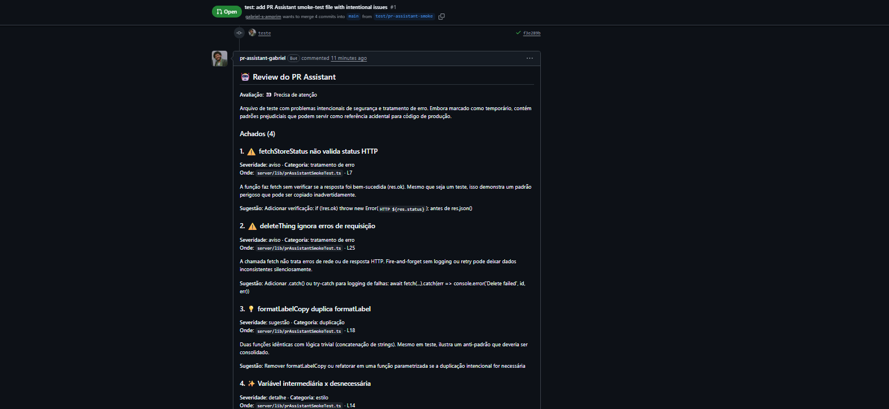
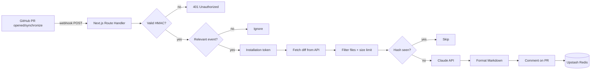

# PR Assistant


**AI code-review bot for GitHub Pull Requests.**  
When someone opens or updates a PR, PR Assistant receives the webhook, analyzes the diff with Claude, and posts a structured comment covering likely bugs, obvious security issues, duplication, and improvements.

> Production-style portfolio project: a real **GitHub App** (JWT + installation token), HMAC validation, rate limiting, diff deduplication, and serverless deploy on Vercel.

[Versão em português](./README.md)

---

## Features

| Feature | Description |
| --- | --- |
| GitHub App | Auth via JWT + installation token (not a PAT) |
| Secure webhook | Validates `X-Hub-Signature-256` before processing |
| Event filter | Only `pull_request` with `opened` or `synchronize` |
| File filter | Ignores lockfiles, binaries, minified & generated files |
| Diff size limit | Controls AI cost and review quality on huge PRs |
| Claude analysis | Structured JSON (Zod) → Markdown comment |
| Redis dedup | Filtered-diff hash skips rebase/push with no real change |
| Rate limit | Per installation/repo (Upstash Ratelimit) |
| Local dry-run | Exercise the flow with a fixture — no real App needed |

---

## Proof it works

Real evidence of the bot commenting on a Pull Request — not a mocked UI.



> **Caption:** screenshot from a **deliberate** smoke-test PR (`test/pr-assistant-smoke`) seeded with intentional code issues (e.g. `fetch` without checking `res.ok`, delete with no error handling, duplicated helper). That file is not production store logic — it exists only to validate the bot. The 4 findings above were posted automatically by the production GitHub App (Haiku, Portuguese comment).

<!-- Optional video: drop a short GIF/MP4 of "open PR → bot comments" here.
Example:

-->

### Regenerate the capture

With a test PR open (and the bot comment already posted):

```bash
pnpm exec playwright install chromium   # first time only

# PowerShell
$env:CAPTURE_PR_URL="https://github.com/YOUR_USER/YOUR_REPO/pull/1"
pnpm capture:pr-review

# bash / macOS / Linux
# CAPTURE_PR_URL="https://github.com/YOUR_USER/YOUR_REPO/pull/1" pnpm capture:pr-review
```

The script opens the PR page, waits for the bot comment, and saves a date-versioned PNG under `docs/screenshots/` (e.g. `pr-review-2026-07-17.png`). Promote the cleanest capture to `pr-review-example.png` for the README.

---

## Results

| Metric | Value |
| --- | --- |
| Automated tests (Vitest) | **21** passing |
| Analysis categories | **8** — bug, security, error handling, duplication, naming, performance, style, other |
| Production evidence | Real comment on the smoke-test PR (screenshot above) |
| Default model | `claude-haiku-4-5` (low cost for portfolio-sized reviews) |

> The `tests-21_passing` badge is static (matches the local suite). For a live GitHub badge, add an Actions workflow that runs `pnpm test` on every push.

---

## Architecture



---

## Stack

- **Next.js 14** (App Router) + Route Handlers
- **TypeScript** + **Zod**
- **pnpm**
- **Octokit** + `@octokit/auth-app`
- **Anthropic SDK** (Claude)
- **Upstash Redis** + Ratelimit
- **Vitest**
- **Vercel** (serverless)

---

## Technical decisions

### Why a GitHub App instead of a Personal Access Token?

| | GitHub App | PAT |
| --- | --- | --- |
| Identity | App identity | Your personal account |
| Permissions | Granular, resource-scoped | Broad / user-scoped |
| Rotation | Short-lived installation tokens | Long-lived secret |
| Install UX | Per repo/org with UI | Manual, brittle |
| Production norm | What real bots use | Fine for personal scripts |

A PAT “works”, but couples the bot to your user account and is an anti-pattern for products. The App signs a **JWT** with its private key, exchanges it for an **installation access token**, and only acts on repos where it is installed.

### Why limit diff size?

Huge diffs are expensive and produce noisy reviews. We keep the most relevant files and note partial analysis in the comment when needed.

### Why Redis for dedup?

`synchronize` fires on every push — including rebases with identical relevant content. We store a **SHA-256 of the filtered diff** per PR and skip re-analysis when unchanged.

---

## Security

- Never process a webhook before HMAC verification
- Never log full diffs or the App private key
- Env vars validated with Zod (fail fast)
- Rate limit per installation/repo
- `.pem` and `.env*` gitignored

---

## Quick start (local dry-run)

```bash
pnpm install
cp .env.example .env.local
# Ensure:
# PR_ASSISTANT_DRY_RUN=true
# GITHUB_WEBHOOK_SECRET=dev-webhook-secret

pnpm dev
# another terminal:
pnpm test:webhook
```

```bash
pnpm test
pnpm build
```

---

# Setup & testing guide (step by step)

Written for someone who has **never** configured a GitHub App.

## 1) Create the GitHub App

1. GitHub → your avatar → **Settings**
2. Bottom left → **Developer settings**
3. **GitHub Apps** → **New GitHub App**
4. Fill in:
   - **Name:** e.g. `PR Assistant YourName`
   - **Homepage URL:** `http://localhost:3000` for now
   - **Webhook:** Active → URL = smee tunnel (section 4) or later your Vercel URL  
     Final shape: `https://your-project.vercel.app/api/webhooks/github`
   - **Webhook secret:** a long random string → save as `GITHUB_WEBHOOK_SECRET`
5. **Permissions → Repository permissions:**
   - **Pull requests:** Read & write (PR + diff files)
   - **Issues:** Read & write (required to post the PR comment via API)
   - **Contents:** Read-only
   - **Metadata:** Read-only
6. **Subscribe to events:** ✅ Pull request
7. Install on **Only on this account** (simplest for portfolio)
8. **Create GitHub App**

### App ID & private key

1. Copy **App ID** → `GITHUB_APP_ID`
2. **Private keys → Generate a private key** (downloads `.pem`)
3. Put it in env as escaped `\n` PEM **or** Base64 of the file — never commit the `.pem`

**PowerShell (Base64):**
```powershell
[Convert]::ToBase64String([IO.File]::ReadAllBytes("path\to\app.pem"))
```

## 2) Run locally

```bash
pnpm install
cp .env.example .env.local
pnpm dev
```

## 3) Test without installing the App

```env
PR_ASSISTANT_DRY_RUN=true
GITHUB_WEBHOOK_SECRET=dev-webhook-secret
```

```bash
pnpm dev
pnpm test:webhook
```

Uses `fixtures/pull_request.opened.json`, signs it, POSTs to the local webhook, and prints the dry-run Markdown comment.

## 4) Expose localhost with smee.io

We use **[smee.io](https://smee.io)** because it is free, account-free, and purpose-built for GitHub webhook development.

1. https://smee.io → **Start a new channel**
2. Paste the channel URL into the GitHub App webhook URL
3. `pnpm add -g smee-client`
4. `smee -u https://smee.io/YOUR_CHANNEL -t http://localhost:3000/api/webhooks/github`
5. Keep `pnpm dev` + `smee` running

(ngrok also works: `ngrok http 3000`.)

## 5) Install on a test repo & open a real PR

1. Create a test repository
2. App → **Install App** → select that repo
3. Set full env with `PR_ASSISTANT_DRY_RUN=false`
4. Open a small PR with a real code change
5. Wait for the bot comment

Debug via **App → Advanced → Recent Deliveries** and server logs.

## 6) Environment variables

| Variable | Where to get it |
| --- | --- |
| `GITHUB_APP_ID` | App settings → App ID |
| `GITHUB_APP_PRIVATE_KEY` | Generate private key (PEM/Base64) |
| `GITHUB_WEBHOOK_SECRET` | You set this on the App |
| `ANTHROPIC_API_KEY` | https://console.anthropic.com |
| `UPSTASH_REDIS_REST_URL` / `_TOKEN` | https://console.upstash.com |
| `PR_ASSISTANT_DRY_RUN` | Local fixture testing |

## 7) Deploy to Vercel

1. Import the repo on Vercel
2. Add production env vars (`PR_ASSISTANT_DRY_RUN=false`)
3. Deploy
4. Update GitHub App webhook URL to  
   `https://your-app.vercel.app/api/webhooks/github`
5. Open a real PR and confirm the comment

---

## Roadmap

- [ ] Inline review comments per line
- [ ] Per-repo config (`.pr-assistant.yml`)
- [ ] Multi-provider AI support
- [ ] Lightweight cost/review dashboard
- [ ] Manual re-run control

---

## License

MIT
