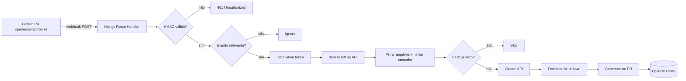

# PR Assistant


**Bot de code review com IA para Pull Requests no GitHub.**  
Quando alguém abre ou atualiza um PR, o PR Assistant recebe o webhook, analisa o diff com Claude e posta um comentário estruturado com bugs prováveis, riscos óbvios de segurança, duplicação e melhorias.

> Projeto de portfólio em nível produção: **GitHub App real** (JWT + installation token), validação HMAC, rate limit, deduplicação de diff e deploy serverless na Vercel.

[English version](./README.en.md)

---

## Funcionalidades

| Funcionalidade | Descrição |
| --- | --- |
| GitHub App | Autenticação via JWT + installation token (não usa PAT) |
| Webhook seguro | Valida `X-Hub-Signature-256` (HMAC-SHA256) antes de processar |
| Filtro de eventos | Só `pull_request` com action `opened` ou `synchronize` |
| Filtro de arquivos | Ignora lockfiles, binários, minificados e gerados |
| Limite de diff | Controla custo e qualidade da análise em PRs enormes |
| Análise com Claude | Resposta JSON estruturada (Zod) → comentário Markdown |
| Dedup com Redis | Hash do diff filtrado evita reanalisar rebase/push sem mudança |
| Rate limit | Limite por instalação/repositório (Upstash Ratelimit) |
| Dry-run local | Testa o fluxo com fixture sem App/Redis/Anthropic reais |

---

## Arquitetura



---

## Stack

- **Next.js 14** (App Router) + Route Handlers
- **TypeScript** + **Zod**
- **pnpm**
- **Octokit** + `@octokit/auth-app`
- **Anthropic SDK** (Claude)
- **Upstash Redis** + Ratelimit
- **Vitest**
- **Vercel** (serverless)

---

## Decisões técnicas

### Por que GitHub App e não Personal Access Token (PAT)?

| | GitHub App | PAT |
| --- | --- | --- |
| Identidade | App da organização/usuário | Sua conta pessoal |
| Permissões | Granulares por recurso | Amplas / ligadas ao usuário |
| Rotação | Installation tokens de curta duração | Token longo, risco se vazar |
| Instalação | Por repositório/org, com UI | Manual, frágil |
| Padrão de produção | O que bots reais usam | Bom para scripts pessoais |

Um PAT “funciona”, mas acopla o bot à sua conta, dificulta auditoria e é um anti-padrão para produtos. O App gera um **JWT** com a chave privada, troca por um **installation access token** e só age nos repos onde foi instalado.

### Por que limitar o tamanho do diff?

Diffs enormes custam caro na API da IA e geram reviews ruins (ruído + contexto cortado). Preferimos analisar os arquivos mais relevantes e avisar no comentário quando a análise for parcial.

### Por que Redis para dedup?

Em `synchronize`, o GitHub dispara webhook a cada push — inclusive rebase sem mudança real no conteúdo. Guardamos o **hash SHA-256 do diff filtrado** por PR. Se o hash for igual, não reanalisamos nem comentamos de novo.

---

## Segurança

- Nunca processa webhook sem validar HMAC primeiro
- Nunca loga o diff completo nem a chave privada do App
- Env vars validadas com Zod (falha rápida com mensagem clara)
- Rate limit por instalação/repo para conter loops de custo
- `.pem` e `.env*` no `.gitignore`

---

## Início rápido (dry-run local)

```bash
pnpm install
cp .env.example .env.local
# Garanta:
# PR_ASSISTANT_DRY_RUN=true
# GITHUB_WEBHOOK_SECRET=dev-webhook-secret

pnpm dev
# em outro terminal:
pnpm test:webhook
```

Você deve ver o JSON da resposta e o Markdown do comentário simulado.

```bash
pnpm test
pnpm build
```

---

# Guia de configuração e teste (passo a passo)

Este guia assume que você **nunca** configurou um GitHub App. Siga na ordem.

## 1) Criar o GitHub App

1. Abra o GitHub logado → clique na sua **foto** (canto superior direito) → **Settings**.
2. No menu esquerdo, role até o final → **Developer settings**.
3. Clique em **GitHub Apps** → **New GitHub App**.
4. Preencha **exatamente** como abaixo (campo a campo da tela *Create GitHub App*):

### Identidade

| Campo | O que colocar |
| --- | --- |
| **GitHub App name** | Nome único, ex. `PR Assistant Gabriel` (precisa estar disponível) |
| **Description** | Opcional. Ex.: `AI code review bot for Pull Requests` |
| **Homepage URL** | `https://pr-reviewer-ai-zeta.vercel.app` (ou o repo: `https://github.com/gabriel-s-amorim/pr-reviewer-ai`) |

### Identifying and authorizing users (OAuth) — deixe vazio / desligado

Este bot **não** faz login de usuário. Ele só age como App instalado no repo.

| Campo | Valor |
| --- | --- |
| **Callback URL** | Deixe **em branco** |
| **Expire user authorization tokens** | ❌ desmarcado |
| **Request user authorization (OAuth) during installation** | ❌ desmarcado |
| **Enable Device Flow** | ❌ desmarcado |

### Post installation — deixe vazio / desligado

| Campo | Valor |
| --- | --- |
| **Setup URL (optional)** | Deixe **em branco** |
| **Redirect on update** | ❌ desmarcado |

### Webhook — isso é o coração do bot

| Campo | Valor |
| --- | --- |
| **Active** | ✅ **marcado** |
| **Webhook URL** | `https://pr-reviewer-ai-zeta.vercel.app/api/webhooks/github` · Não precisa de localhost nem smee |
| **Secret** | Invente uma string longa e aleatória. **Guarde agora** — vai nas env vars da Vercel como `GITHUB_WEBHOOK_SECRET` |

> Ordem prática: 1) deploy na Vercel → 2) criar o GitHub App com a URL de produção → 3) colar App ID, private key, secret e Redis/Anthropic nas Environment Variables da Vercel → 4) Redeploy.

### Permissions → Repository permissions

Abra **Repository permissions** e mude **só** estes (o resto fica **No access**):

| Permissão | Valor | Por quê |
| --- | --- | --- |
| **Metadata** | Read-only | Obrigatório (já vem assim) |
| **Contents** | Read-only | Ler código/diff se necessário |
| **Issues** | Read & write | Postar o comentário no PR (`issues.createComment`) |
| **Pull requests** | Read & write | Ler o PR e a lista de arquivos do diff |

**Organization permissions:** tudo **No access**  
**Account permissions:** tudo **No access**

### Subscribe to events

Com as permissões acima, marque **apenas**:

- ✅ **Pull request**

Deixe desmarcados: Installation target, Meta, Security advisory, e qualquer outro.

### Where can this GitHub App be installed?

- ✅ **Only on this account** (`@gabriel-s-amorim`) — certo para portfólio/teste
- ❌ Any account — só se quiser que outras pessoas instalem

5. Clique em **Create GitHub App**.

### Pegar App ID e chave privada

1. Na página do App recém-criado, copie o **App ID** → `GITHUB_APP_ID`.
2. Role até **Private keys** → **Generate a private key**.
3. O GitHub baixa um arquivo `.pem`. **Não commite esse arquivo.**
4. Para o `.env.local`, converta as quebras de linha em `\n` (uma linha só), ou use Base64 do arquivo inteiro:

**PowerShell (Base64):**
```powershell
[Convert]::ToBase64String([IO.File]::ReadAllBytes("caminho\para\app.pem"))
```

Cole o resultado em `GITHUB_APP_PRIVATE_KEY`.

## 2) Rodar o projeto localmente

```bash
pnpm install
cp .env.example .env.local
pnpm dev
```

Abra `http://localhost:3000`. Health: `http://localhost:3000/api/health`.

## 3) Testar SEM instalar o App (fixture + script)

Ideal antes de criar o App ou configurar Redis/Anthropic.

No `.env.local`:

```env
PR_ASSISTANT_DRY_RUN=true
GITHUB_WEBHOOK_SECRET=dev-webhook-secret
```

Terminal 1:
```bash
pnpm dev
```

Terminal 2:
```bash
pnpm test:webhook
```

O script:
1. Lê `fixtures/pull_request.opened.json`
2. Assina com HMAC (`X-Hub-Signature-256`)
3. Faz POST em `/api/webhooks/github`
4. Imprime a resposta — incluindo o comentário Markdown gerado em dry-run

Isso valida: assinatura, filtro de evento, ignore de lockfiles, formatação do review.

## 4) Expor o localhost para webhook real (smee.io)

**Escolhi [smee.io](https://smee.io)** (não ngrok) porque:
- É gratuito e feito exatamente para webhooks do GitHub
- Não precisa conta
- O GitHub documenta esse fluxo para Apps em desenvolvimento

### Passo a passo smee

1. Abra https://smee.io → **Start a new channel**.
2. Copie a URL (ex. `https://smee.io/abcdefgh`).
3. No GitHub App → **Webhook URL**, cole essa URL do smee (temporário).
4. Instale o cliente:
   ```bash
   pnpm add -g smee-client
   ```
5. Encaminhe para o Next local:
   ```bash
   smee -u https://smee.io/SEU_CANAL -t http://localhost:3000/api/webhooks/github
   ```
6. Deixe `pnpm dev` + `smee` rodando juntos.
7. Quando o GitHub enviar um evento, o smee repassa para o seu PC.

> Alternativa: **ngrok** (`ngrok http 3000`) se você já usa ngrok. Funciona igual, mas exige conta para URLs estáveis.

## 5) Instalar o App num repositório de teste e abrir um PR real

1. Crie um repo de teste (pode ser privado).
2. No GitHub App → **Install App** → escolha sua conta → selecione **Only select repositories** → marque o repo de teste → **Install**.
3. Configure o `.env.local` com **todas** as variáveis reais e `PR_ASSISTANT_DRY_RUN=false`.
4. Garanta que o webhook aponta para o smee (dev) ou Vercel (prod).
5. No repo de teste, abra um branch, faça uma mudança pequena em um `.ts`/`.js`, abra um Pull Request.
6. Em alguns segundos o App deve comentar no PR.

Se nada acontecer:
- Veja **GitHub App → Advanced → Recent Deliveries** (status e payload)
- Veja o terminal do `pnpm dev` / logs da Vercel
- Confirme que o secret do webhook é idêntico ao `GITHUB_WEBHOOK_SECRET`

## 6) Variáveis de ambiente — o que é cada uma e onde pegar

| Variável | O que é | Onde obter |
| --- | --- | --- |
| `GITHUB_APP_ID` | ID numérico do App | Página do GitHub App → App ID |
| `GITHUB_APP_PRIVATE_KEY` | Chave privada PEM (ou Base64) | Private keys → Generate a private key |
| `GITHUB_WEBHOOK_SECRET` | Segredo HMAC do webhook | Você define na criação do App (Webhook secret) |
| `ANTHROPIC_API_KEY` | Chave da API Claude | https://console.anthropic.com → API Keys |
| `ANTHROPIC_MODEL` | Modelo (opcional) | Default: `claude-haiku-4-5` (barato e ótimo pra review) |
| `UPSTASH_REDIS_REST_URL` | URL REST do Redis | https://console.upstash.com → Redis → REST API |
| `UPSTASH_REDIS_REST_TOKEN` | Token REST | Mesma tela do Upstash |
| `PR_ASSISTANT_DRY_RUN` | `true`/`false` | Só local/fixture |

### Upstash Redis (rápido)

1. Crie conta em https://console.upstash.com
2. **Create Database** → região perto de você → Free
3. Aba **REST API** → copie `UPSTASH_REDIS_REST_URL` e `UPSTASH_REDIS_REST_TOKEN`

## 7) Deploy na Vercel e trocar a URL do webhook

1. Suba o repo para o GitHub.
2. Em https://vercel.com → **Add New Project** → importe o repo.
3. Em **Environment Variables**, adicione todas as vars de produção (`PR_ASSISTANT_DRY_RUN=false`).
4. Deploy.
5. Copie a URL, ex. `https://pr-assistant-seuuser.vercel.app`.
6. No GitHub App → **Webhook URL** →  
   `https://pr-assistant-seuuser.vercel.app/api/webhooks/github`
7. Salve. Em **Recent Deliveries**, redeliver um evento de teste se quiser.
8. Abra um PR de verdade no repo com o App instalado e confira o comentário.

---

## Estrutura do projeto

```
src/
  app/api/webhooks/github/route.ts   # Entrypoint do webhook
  lib/github/signature.ts            # HMAC X-Hub-Signature-256
  lib/github/auth.ts                 # JWT App → installation token
  lib/github/events.ts               # Filtro opened/synchronize
  lib/diff/filter.ts                 # Ignore + limite de tamanho
  lib/ai/analyze.ts                  # Claude + mock dry-run
  lib/review/format-comment.ts       # JSON → Markdown
  lib/review/process-pr.ts           # Orquestração
  lib/review/dedup.ts                # Redis hash por PR
fixtures/pull_request.opened.json    # Payload de exemplo
scripts/test-webhook.ts              # pnpm test:webhook
tests/                               # Vitest (lógica pura)
```

---

## Roadmap

- [ ] Comentários inline (review comments por linha) além do comentário geral
- [ ] Config por repositório (`.pr-assistant.yml`: severidade mínima, ignore extra)
- [ ] Suporte a mais de um provedor de IA
- [ ] Dashboard simples de reviews / custo estimado
- [ ] Assinatura de “já revisado” com botão de re-run manual

---

## Licença

MIT — use no portfólio, estude e adapte.
